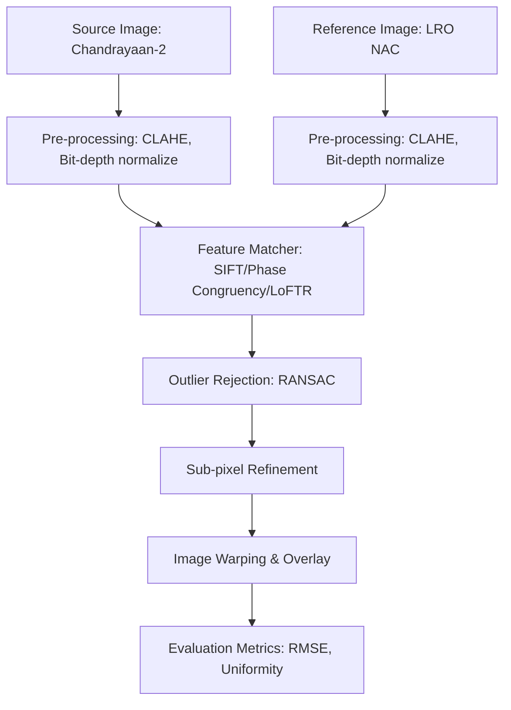

# Pipeline Architecture

Below is the conceptual architecture of the Smart India Hackathon Lunar Image Registration System.

## Description of Components

1.  **Data Loader**: Loads planetary imagery formats (.img/.lbl PDS3/4 format via `pdr`) and standard files (.tif/.png/.jpg via `rasterio`/`cv2`).
2.  **Pre-processing**: Resolves scale, bit-depth (e.g. 16-bit to 8-bit dynamic stretching), and illumination issues (using localized CLAHE contrast enhancement).
3.  **Feature Matching**:
    *   *SIFT/ORB Baseline*: Classical local descriptors.
    *   *Phase Congruency*: Focuses on edge features invariant to lighting and shadow changes.
    *   *LoFTR*: Deep learning matches using local feature transformers on dense structures.
4.  **Outlier Rejection**: Performs RANSAC homography projection estimation to eliminate false match lines.
5.  **Sub-pixel Refinement**: Refines remaining match points using sub-pixel interpolation methods like `cornerSubPix`.
6.  **Evaluation**: Computes alignment RMSE, inlier count, and spatial uniformity across an NxN check-grid.
